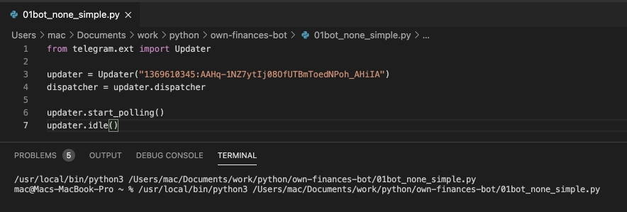
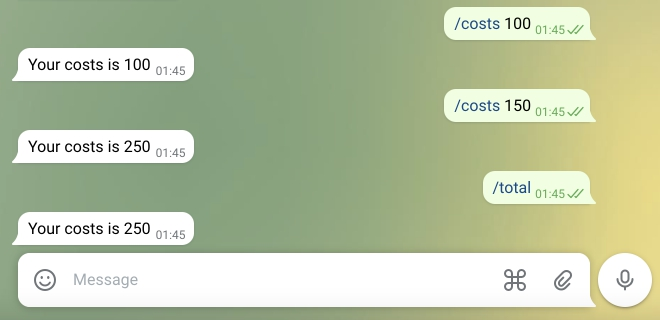

# Создание телеграм бота
**Телеграмм-бот** - это компьютерная программа, для месенджера Telegram. Боты позволяют автоматизировать многие действия: от предоставления информации до учета финансов и организации продаж.  
Для написания нашего телеграмм-бота мы используем язык программирования **Python** и библиотеку **python-telegram-bot**. Потому что **Python** можно запустить и локально и на сервере, а **python-telegram-bot** - это простая и обновляемая библиотека для написания телеграм-ботов.  
Телеграмм-бот - это программа, которая получает сообщения от телеграмм-пользователя, обрабатывает их и отправляет ответ.

## Среда запуска
### Запуск на своем комеьютере
Для того, чтобы запустить любую программу необходима среда для ее запуска. Для запуска Python нам необходимо установить интерпретатор на ваш компьютер (<a href = 'https://www.python.org/downloads/'>https://www.python.org/downloads/</a>), установить программу для работы с кодом <a href = 'https://code.visualstudio.com/download'>MS VS Code</a> и установить в ней плагин для работы с Python.
### Запуск на внешнем сервере
Запустить Python также можно и на внешних серверах: <a href = 'https://www.pythonanywhere.com/'>https://www.pythonanywhere.com/</a>, <a href = 'https://replit.com/'>https://replit.com/</a>

### Работа языка программирования Python

### Подключение бота


## Пустой бот
Самый простой бот - это бот, который ничего не делает. Он просто запускается. Такой бот позволит нам проверить, все ли у нас хорошо с подключением к боту и его запуском в редакторе кода.
```python
from telegram.ext import Updater

updater = Updater("1369610345:AAHq-1NZ7ytIj08OfUTBmToedNPoh_AHiIA")
dispatcher = updater.dispatcher
print("Bot is live!")

updater.start_polling()
updater.idle()
```
  


## Эхо-бот
Самым простым функционалом для телеграм-бота является эхо-бот. Эхо-бот - это такой бот, который отправляет в ответ все сообщения, которые он получил. Ниже приведен код бота, который отправляет в ответ тот же текст сообщения, который получает от пользователя.

```python
from telegram.ext import Updater, MessageHandler, Filters

def echo(update, context):
    update.message.reply_text(update.message.text)

updater = Updater("1369610345:AAHq-1NZ7ytIj08OfUTBmToedNPoh_AHiIA")
dispatcher = updater.dispatcher

dispatcher.add_handler(MessageHandler(Filters.all, echo))

updater.start_polling()
updater.idle()
```
  

## Обработка команд
В телеграмме существует правило, что команды начинаются с символа / . Реализуем функционал, что наш бот будет проверять является ли первый символ строки равным /. Если является - вначале пользователю отправляется сообщение "This is command", а затем - команда.
```python
from telegram.ext import Updater, MessageHandler, Filters

def echo(update, context):
    string = update.message.text
    print(string[0])
    if  '/' in string[0] : 
        chat = update.effective_chat
        context.bot.send_message(chat_id=chat.id, text="This is command")
    update.message.reply_text(update.message.text)

updater = Updater("1369610345:AAHq-1NZ7ytIj08OfUTBmToedNPoh_AHiIA")
dispatcher = updater.dispatcher

dispatcher.add_handler(MessageHandler(Filters.all, echo))

updater.start_polling()
updater.idle()
```
## Команда и ее параметр
Добавим команды "Расходы", при этом будем сохранять значение числа, которое идет после команды. Для этого разделим полученную от пользователя строку на части с помощью метода split (разделителем будет выступать пробел)
```python
from telegram.ext import Updater, MessageHandler, Filters

def echo(update, context):
    string = update.message.text
    print(string[0])

    if  '/costs' in string[0:6] : 
        chat = update.effective_chat
        context.bot.send_message(chat_id=chat.id, text="This is costs")
        costs = string.split(' ')
        context.bot.send_message(chat_id=chat.id, text="Your costs is "+costs[1])

    update.message.reply_text(update.message.text)

updater = Updater("1369610345:AAHq-1NZ7ytIj08OfUTBmToedNPoh_AHiIA")
dispatcher = updater.dispatcher

dispatcher.add_handler(MessageHandler(Filters.all, echo))

updater.start_polling()
updater.idle()
```
## Обработка команд
Библиотека, с которой мы работаем умеет определять команды от простых сообщений. Для этого диспетчеру добавляется обработчик получения команды, который соединяет команду и функцию, которая будет запускаться, когда пользователь будет использовать эту команду. Для реализации данной возможности необходимо дополнительно импортировать объект **CommandHandler**.
Самой часто встречающейся командой является команда **/start** она выполняется когда пользователь первый раз подключается к боту.
```python
from telegram.ext import Updater, MessageHandler, Filters, CommandHandler

def start(update, context):
    chat = update.effective_chat
    context.bot.send_message(chat_id=chat.id, text="Hello! This home finance bot.")

def echo(update, context):
    update.message.reply_text(update.message.text)

updater = Updater("1369610345:AAHq-1NZ7ytIj08OfUTBmToedNPoh_AHiIA")
dispatcher = updater.dispatcher

dispatcher.add_handler(CommandHandler("start", start))
dispatcher.add_handler(MessageHandler(Filters.all, echo))

updater.start_polling()
updater.idle()
```
## Получение значений параметров команды и их сумирование.
Существует возможность передавать параметр после команды: для этого после имени команды указывается сам параметр. Например при команде **/costs** будет читать размер расходов. Например, если пользователь потратил 10 долларов он должен написать  **/costs 10**.
В прошлых заданиях мы с вами уже получали значения, которые вводили после команды.  
В этом разделе мы не только получим значение параметра и будем суммировать в переменной **n_costs** общий размер расходов, о которых сообщил пользователь боту за время его работы.
```python
from telegram.ext import Updater, MessageHandler, Filters, CommandHandler

n_costs = 0 

def start(update, context):
    chat = update.effective_chat
    context.bot.send_message(chat_id=chat.id, text="Hello! This home finance bot.")

def costs(update, context):
    global n_costs

    string = update.message.text
    costs = string.split(' ')
    n_costs = n_costs + int(costs[1])
    
    chat = update.effective_chat
    context.bot.send_message(chat_id=chat.id, text="Your costs is "+str(n_costs))


def echo(update, context):
    update.message.reply_text(update.message.text)

updater = Updater("1369610345:AAHq-1NZ7ytIj08OfUTBmToedNPoh_AHiIA")
dispatcher = updater.dispatcher

dispatcher.add_handler(CommandHandler("start", start))
dispatcher.add_handler(CommandHandler("costs", costs))
dispatcher.add_handler(MessageHandler(Filters.all, echo))

updater.start_polling()
updater.idle()
```
## Сохранение команд в файл
Для того, чтобы данные сохранялись даже при условии отключения бота необходимо использовать инструменты постоянного хранения данных. Самым простым способом хранения данных таким образом является хранение в файле. В данной версии программы мы все сообщения пользователя будем дописывать в файл. Это позволит впоследствии читать из этого файла данные и проводить общий подсчет данных, введенных пользователем.

```python
from telegram.ext import Updater, MessageHandler, Filters, CommandHandler

n_costs = 0 

def start(update, context):
    chat = update.effective_chat
    context.bot.send_message(chat_id=chat.id, text="Hello! This home finance bot.")

def costs(update, context):
    global n_costs

    string = update.message.text
    costs = string.split(' ')
    n_costs = n_costs + int(costs[1])
    
    chat = update.effective_chat
    context.bot.send_message(chat_id=chat.id, text="Your costs is "+str(n_costs))
    f = open('log_bot.txt', 'a')
    f.write(update.message.text)
    f.write(' \n')
    f.close()


def echo(update, context):
    update.message.reply_text(update.message.text)

updater = Updater("1369610345:AAHq-1NZ7ytIj08OfUTBmToedNPoh_AHiIA")
dispatcher = updater.dispatcher

dispatcher.add_handler(CommandHandler("start", start))
dispatcher.add_handler(CommandHandler("costs", costs))
dispatcher.add_handler(MessageHandler(Filters.all, echo))

updater.start_polling()
updater.idle()
```
## Чтение из файла
В файле хранятся все сообщение пользователя и, как следствие, данные о его расходах за определенный период. Добавим команды **/total** при вводе которой программа будет читать данные, которые были сохранены в файл и подсчитывать общее количество затрат, о которых сообщил пользователь боту.
```python
from telegram.ext import Updater, MessageHandler, Filters, CommandHandler

n_costs = 0 

def start(update, context):
    chat = update.effective_chat
    context.bot.send_message(chat_id=chat.id, text="Hello! This home finance bot.")

def costs(update, context):
    global n_costs

    string = update.message.text
    costs = string.split(' ')
    n_costs = n_costs + int(costs[1])
    
    chat = update.effective_chat
    context.bot.send_message(chat_id=chat.id, text="Your costs is "+str(n_costs))
    # f = open('/Users/mac/Documents/work/python/own-finances-bot/python-telegram-bot/log_bot.txt', 'w')
    f = open('log_bot.txt', 'a')
    f.write(update.message.text)
    f.write(' \n')
    f.close()

def total(update, context):
    f =  open('log_bot.txt', 'r')
    n_total=0
    for line in f:
        elements = line.split(' ')
        n_total = n_total +int(elements[1])       
    f.close()
    chat = update.effective_chat
    context.bot.send_message(chat_id=chat.id, text="Your costs is "+str(n_total))


def echo(update, context):
    update.message.reply_text(update.message.text)

updater = Updater("1369610345:AAHq-1NZ7ytIj08OfUTBmToedNPoh_AHiIA")
dispatcher = updater.dispatcher

dispatcher.add_handler(CommandHandler("start", start))
dispatcher.add_handler(CommandHandler("costs", costs))
dispatcher.add_handler(CommandHandler("total", total))
dispatcher.add_handler(MessageHandler(Filters.all, echo))

updater.start_polling()
updater.idle()
```


## Список категорий
## Установка категорий
## Удаление категорий
## Учет категорий
## Выдача расходов по категориям
